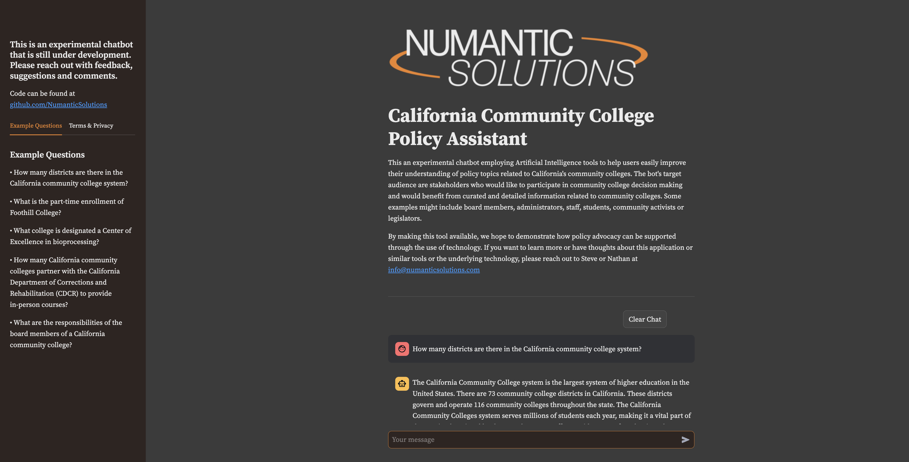
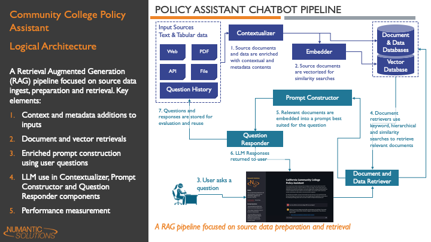

<h1> $${\color{#ed8428}California Community College Policy Assistant}$$ </h1>

# $\textsf{\color{#f5750e}{Introduction}}$ 

Some introduction text.

### $\textsf{\color{#f48522}{Phase 1.}}$

Some phase 1 text.

#### $\textsf{\color{#326a95}{Section A.}}$  

Some section a text.

## Overview

This an experimental chatbot employing Artificial Intelligence tools to help users easily improve their understanding of policy topics related to California's community colleges. The bot's target audience are stakeholders who would like to participate in community college decision making and would benefit from curated and detailed information related to community colleges. Some examples might include board members, administrators, staff, students, community activists or legislators.

By making this tool available, we hope to demonstrate how policy advocacy can be supported through the use of technology. If you want to learn more or have thoughts about this application or similar tools or the underlying technology, please reach out.

June 4, 2025

## Contact

[Numantic Solutions - numanticsolutions.com](https://numanticsolutions.com/)  
[California Community College Policy Assistant](https://ccc-polasst.numanticsolutions.com/)  
Email: Steve or Nathan at [info@numanticsolutions.com](info@numanticsolutions.com)

## Project status

This is an active project still in development, and there are frequent changes to this repository's contents and the Policy Assistant's functionality. The following table highlights our current key work areas and objectives.

| **Focus Area**                    | **Description**                                                             | **Objectives**                                                                                                                                                                            |
|-----------------------------------|-----------------------------------------------------------------------------|-------------------------------------------------------------------------------------------------------------------------------------------------------------------------------------------|
| Data source ingestion             | Data sources including web pages, PDF files and tabular data (eg CSV files) | <ol><li>Expand content base relevant to Community colleges</li><li>Clean content and add context and metadata</li><li>Store and vectorize content to facilitate future searches</li></ul> |
| Prompt construction               | Document retrieval and prompt construction exapanding on user questions     | <ol><li>Build robust content-retrieval tools </li><li>Construct effective LLM prompts</li></ul>                                                                                           |
| Model selection and configuration | Large Language Model (LLM) and parameter configuration                      | <ol><li>Identify LLM foundation most effective for this task </li><li>Determine most effective LLM configuration</li><li>Explore fine tuning the LLM</li></ul>                            |
| Performance measurement           | Chatbot quality assessment                                                  | <ol><li>Expand question and answer evaluation data</li><li>Extend testing framework to all components</li><li>Establish a continuous user-feedback loop</li></ul>                         |

## User Interface

A working prototype can be found at [ccc-polasst.numanticsolutions.com](https://ccc-polasst.numanticsolutions.com/).

## Architecure

Although this tool is underdevelopment and its architecture is likely to change, here is a good depiction of the current technological architecture.

## Technology

Although this tool is underdevelopment and its technological components are likely to change, here are some current key technologies.

### Technological Components

- Coding Language: [Python](https://www.python.org/)
- RAG Framework: [LangChain](https://www.langchain.com)
- Vector Database: [Chroma](https://www.trychroma.com/)
- Embedding Model: [Text-embedding-004](https://cloud.google.com/vertex-ai/generative-ai/docs/model-reference/text-embeddings-api)
- AI Large language Model (LLM): [Gemini-1.5-pro](https://ai.google.dev/gemini-api/docs/models/gemini)
- Document & Vector Storage: [Google Cloud Storage](https://cloud.google.com/?hl=en)
- User Interface: [Google Cloud Run](https://cloud.google.com/?hl=en) and [Streamlit](https://streamlit.io)

