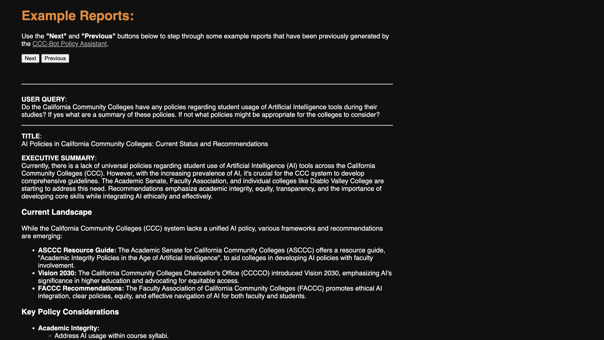

<div style="text-align: center;">

</div> 


## Policy Assistant V3 Overview

### Application Summary
This is an experimental, open-source policy-writing chatbot employing Artificial Intelligence tools to help users easily improve their understanding of policy topics related to California's community colleges. 

For demonstration purposes, consider the policy report writer's target audience to be stakeholders who would like to participate in community college decision making and would benefit from well-researched information related to community colleges. Some examples might include board members, administrators, staff, students, community activists or legislators.

However, the project's primary purpose is demonstrate that with a manageable effort level, teams can 
1. Collect and curate unique datasets
2. Leverage those datasets in powerful AI applications.

### Policy Report Writer (versus a chatbot)

This AI tool has been designed to generate through research reports in response to complex policy queries. It, for example, is intended to address a question such as `How does proposition 98 affect California community college funding?` by providing an executive summary, report body and references. Users will still get that output even if the query could be simply answered. The question ` What year was Barstow Community College founded?` will, by design, produce a multi-paragraph response even though `Barstow College was founded in 1959` might suffice. In one example response, the report writer ran with the `Barstow founding` question and produced a report titled: `Barstow Community College: An Overview of Its History, Programs, and Services.`

### Production Deployments
| **Live Policy Assistant Chatbot**                                                                                                                                                                                                                                        | **Example Queries and Responses**                                                                                                                                                                                                                                                                        |
|:-------------------------------------------------------------------------------------------------------------------------------------------------------------------------------------------------------------------------------------------------------------------------|:---------------------------------------------------------------------------------------------------------------------------------------------------------------------------------------------------------------------------------------------------------------------------------------------------------|
| <div style="text-align: center;"><a href="https://ccc-polasst.numanticsolutions.com/"><p>Click to see the live Policy Assistant</p></a></div>           | <div style="text-align: center;"><a href="https://eternal-bongo-435614-b9.uc.r.appspot.com/example_reports"><p>Click to see query-reponse examples</p></a></div>                          |


#### Project Objectives
By making this tool available, we hope to demonstrate how policy advocacy can be supported through the use of technology. We call it experimental because it is meant to be a playground project in which various AI data-curation, machine-learning and artificial-intelligence technologies can be tried and tested. By collecting and curating public data and by feeding into custom AI applications, we can demonstrate the full-stack of an AI solution. This will help anyone looking to build similar tools, especially those in social impact. 

If you want to learn more or have thoughts about this application or similar tools or the underlying technology, please reach out.

#### Version 
- V3: 20251108
- Nov 8, 2025 


## Contact

Please reach out to Steve or Nathan
- [Numantic Solutions](https://numanticsolutions.com/)

## Workflow Architecture

We're still working on the tool, but here is a broad overview of Version 2's workflow components.


## Technology

Although this tool is underdevelopment and its technological components are likely to change, here are some current key technologies.

### Technological Components

- Coding Language: [Python](https://www.python.org/)
- AI Agent Framework: [Google Agent Deveopment Kit (ADK)](https://google.github.io/adk-docs/)
- AI Agent Deployment Platform: [Google Vertex AI](https://cloud.google.com/vertex-ai?hl=en)
- AI Large language Model (LLM): [Gemini-2.5-flash](https://ai.google.dev/gemini-api/docs/models/gemini)
- Document & Vector Storage: [Google Cloud Storage](https://cloud.google.com/?hl=en)
- User Interface: [Google Cloud Run](https://cloud.google.com/?hl=en) and [Streamlit](https://streamlit.io)

### Quick Start

1. Ensure your environment has all the necessary files. We use [Anaconda](https://www.anaconda.com/) to create virtual environments. In this repo, the Conda configuration file can be found in `data\environment\environment_ns_research.yml`.
2. To see the bot in action on a local machine, run the following command line script: `streamlit run app.py` from the `interface` directory.

## What's in the Repo?

This repo contains the full data pipeline code. This covers data ingestion through web crawling, AI agent creation and application deployment in a user interface.

Code is organized by task and saved in subdirectories with key folders highlighted below.

```
ccc-policy_assistant/
│
├── agents/  ---> Agent development
│   └── ccc_policybot
│       ├── rag
│       ├── search
│       └── synthesis
├── ingestion/  ---> Data collection
│   └── ccc_policybot
│       ├── crawl_tools
│       ├── data
│       └── vai_search
├── interface/  ---> USer interface
│   ├── agent_handlers
│   ├── data
│   ├── utilities
```


