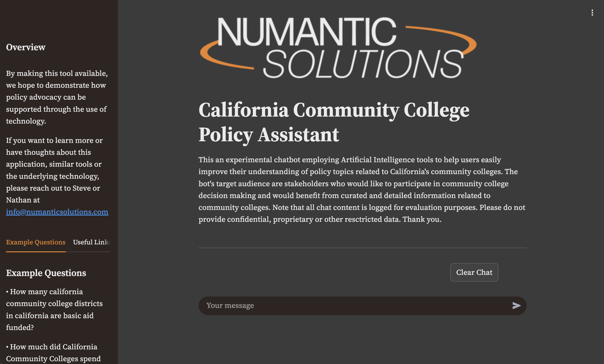

  <h1>Community College Policy Assistant V2</h1>

## Overview

This is an experimental, open-source chatbot employing Artificial Intelligence tools to help users easily improve their understanding of policy topics related to California's community colleges. The bot's target audience are stakeholders who would like to participate in community college decision making and would benefit from curated and detailed information related to community colleges. Some examples might include board members, administrators, staff, students, community activists or legislators.

| **Live Policy Assistant Chatbot**                                                                                                                                                                                                                                        | **Example Queries and Responses**                                                                                                                                                                                                                                                                        |
|:-------------------------------------------------------------------------------------------------------------------------------------------------------------------------------------------------------------------------------------------------------------------------|:---------------------------------------------------------------------------------------------------------------------------------------------------------------------------------------------------------------------------------------------------------------------------------------------------------|
| 
<a href="https://ccc-polasst.numanticsolutions.com/">
Click to see the live Policy Assistant
</a>
           | 
<a href="https://eternal-bongo-435614-b9.uc.r.appspot.com/example_reports">
Click to see query-reponse examples
</a>
                          |

By making this tool available, we hope to demonstrate how policy advocacy can be supported through the use of technology. We call it experimental because it is meant to be a playground project in which various AI data-curation, machine-learning and artificial-intelligence technologies can be tried and tested. By collecting and curating public data and by feeding into custom AI applications, we can demonstrate the full-stack of an AI solution. This will help anyone looking to build similar tools, especially those in social impact. 

If you want to learn more or have thoughts about this application or similar tools or the underlying technology, please reach out.

Aug 11, 2025

## Contact

Please reach out to Steve or Nathan
- [Numantic Solutions - numanticsolutions.com](https://numanticsolutions.com/)  

## Workflow Architecture

Although this tool is underdevelopment and its architecture is likely to change, here is a good depiction of the current technological architecture.

## Technology

Although this tool is underdevelopment and its technological components are likely to change, here are some current key technologies.

### Technological Components

- Coding Language: [Python](https://www.python.org/)
- AI Agent Framework: [Google Agent Deveopment Kit (ADK)](https://google.github.io/adk-docs/)
- AI Agent Deployment Platform: [Google Vertex AI](https://cloud.google.com/vertex-ai?hl=en)
- AI Large language Model (LLM): [Gemini-2.5-flash](https://ai.google.dev/gemini-api/docs/models/gemini)
- Document & Vector Storage: [Google Cloud Storage](https://cloud.google.com/?hl=en)
- User Interface: [Google Cloud Run](https://cloud.google.com/?hl=en) and [Streamlit](https://streamlit.io)

Aug 11, 2025

## Quick start

1. Ensure your environment has all the necessary files. We use [Anaconda](https://www.anaconda.com/) to create virtual environments. In this repo, the Conda configuration file can be found in `data\environment\environment_adk.yml`.
2. To see the bot in action on a local machine, run the following command line script: `streamlit run app.py` from the interface directory (`interface`).

## What's next

This repo is still under development and we still need to add the code for 

1. Ingesting web data
2. Creating and deploying ADK agents
3. Deploying the Streamlit application to GCP

